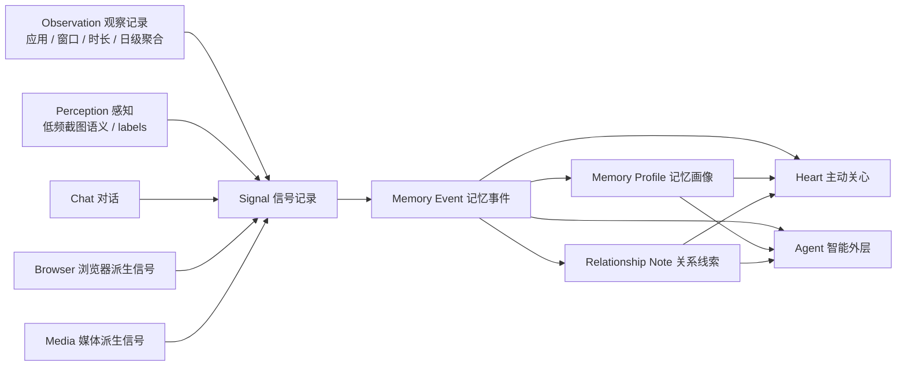
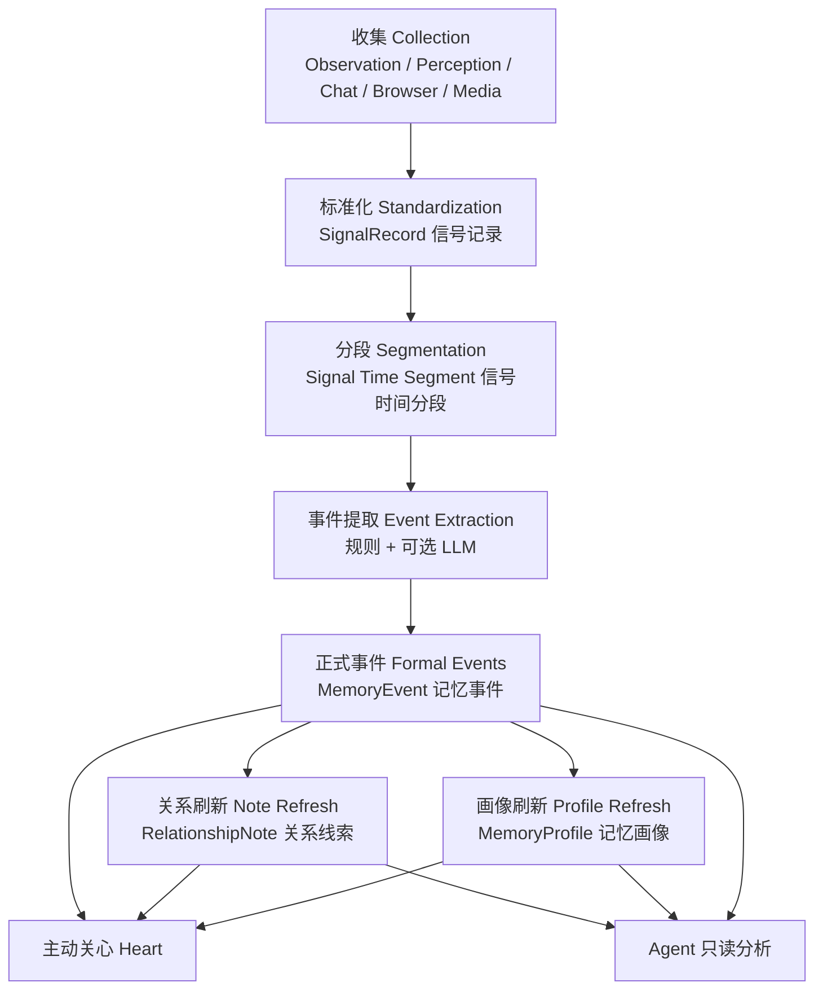
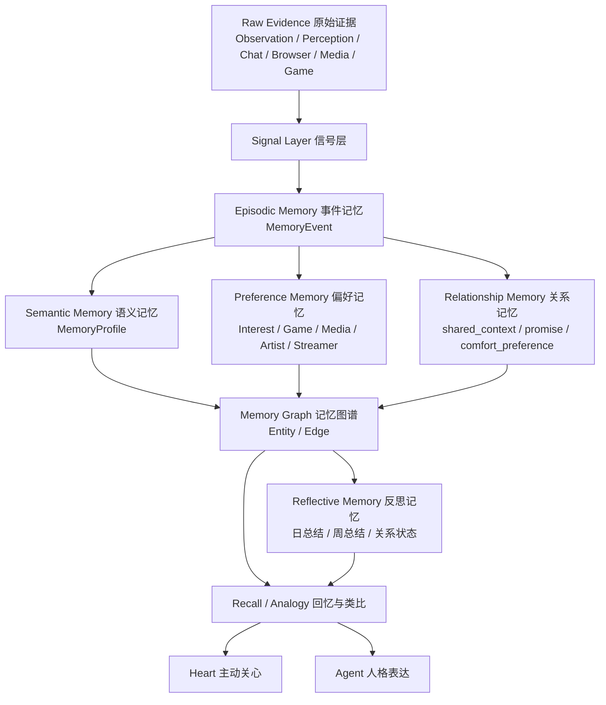
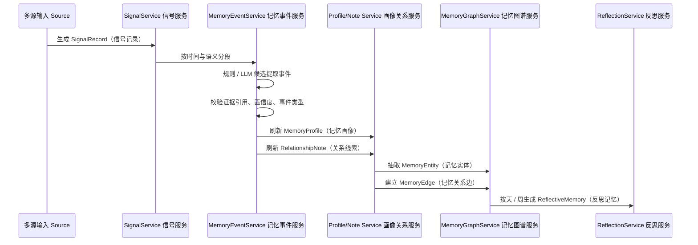
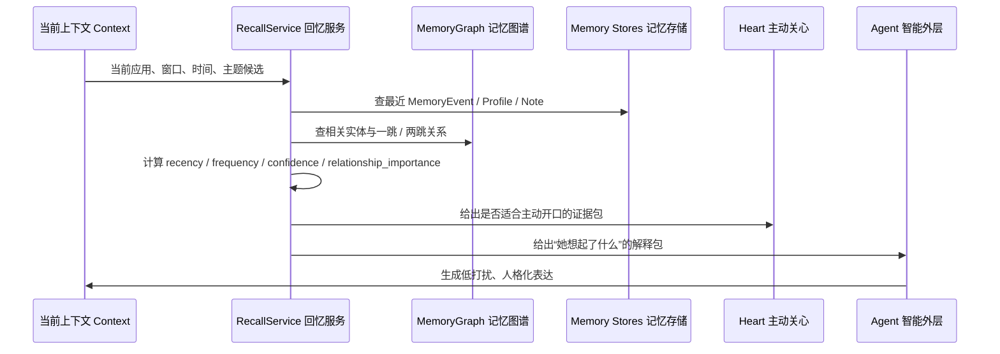
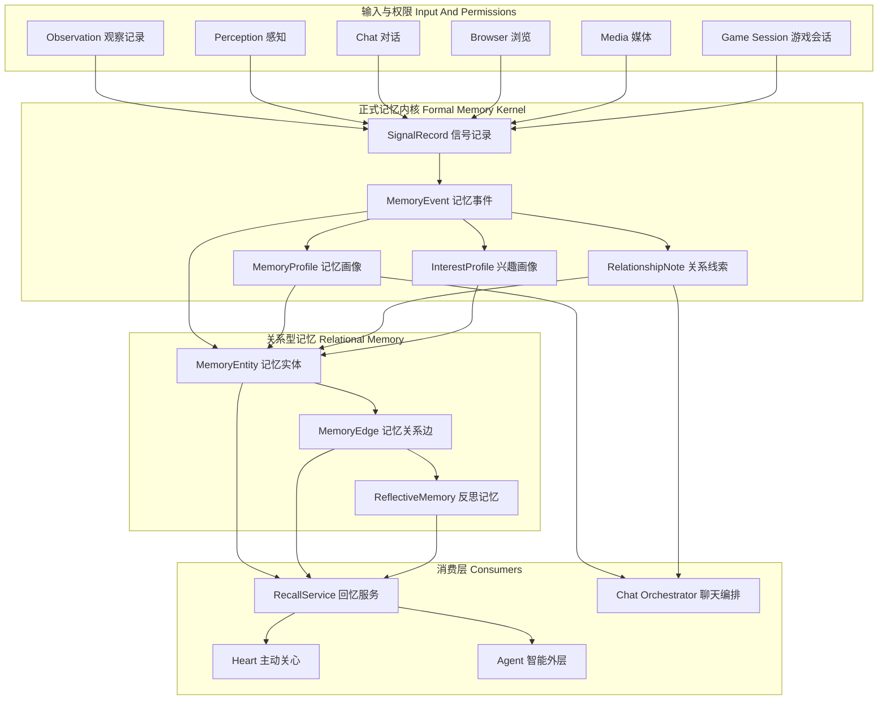

# 桌宠最终记忆系统详解

创建时间：2026-05-03  
适用仓库：`agent-desktop-pet`  
定位：解释当前 `Memory System（记忆系统）` 已经做到什么，以及最终应如何演进成满足原始 `PRD（Product Requirements Document，产品需求文档）` 的长期陪伴记忆系统。

---

## 1. 一句话结论

当前系统已经不是简单的 `RAG（Retrieval-Augmented Generation，检索增强生成）` 或“聊天记录检索”，而是一套正在成型的 `companion-native Memory Kernel（桌宠原生记忆内核）`：

```text
Observation / Perception / Chat / Browser / Media / Game
  -> Signal（信号）
  -> Memory Event（记忆事件）
  -> Memory Profile（记忆画像） / Relationship Note（关系线索）
  -> Heart（主动关心） / Agent（智能外层）
```

但它距离原始 `PRD（产品需求文档）` 中“像一个人一样逐渐了解你”的目标还差关键三层：

1. `Interest / Preference Memory（兴趣 / 偏好记忆）`
2. `Memory Graph（记忆图谱）`
3. `Reflective Memory（反思记忆）`

最终目标不是把记忆做成更大的向量库，而是做成：

```text
多源事实 -> 生活事件 -> 兴趣画像 -> 关系图谱 -> 回忆类比 -> 主动陪伴表达
```

---

## 2. 原始 PRD 对记忆系统的真实要求

原始 `PRD（产品需求文档）` 的核心诉求不是“回答问题更准”，而是：

- 桌宠像一个长期陪伴对象，而不是工具。
- 她能默默了解用户的生活习惯、电脑使用习惯和兴趣偏好。
- 她能在低打扰前提下主动出现，而不是所有事情都等用户问。
- 她要知道“我最近在干什么”“我常常喜欢什么”“我和她之间有什么共同经历”。
- 记忆能力必须有权限开关，不能越过隐私边界。
- 记忆模块要可替换，未来可以接入 `mem0（通用长期记忆层）`、`Graphiti（时间感知知识图谱）`、`memU（文件系统式长期记忆）` 等实现，但不能绑死前端主交互。

详细 `PRD（产品需求文档）` 还给出可验证指标：

- 记忆至少区分 `Working Memory（工作记忆）`、`Episodic Memory（事件记忆）`、`Semantic Memory（语义记忆）`。
- 能召回用户偏好、习惯和近期事件。
- 用户可以查看、删除或关闭某类记忆采集。
- `20` 条预设记忆测试样本中，召回准确率目标为 `>=80%`。
- 不能召回用户明确关闭采集的隐私信息。

---

## 3. 当前记忆系统是什么样的

### 3.1 当前总体结构



当前系统已经完成了“多源事实进入统一信号，再形成事件、画像和关系线索”的第一阶段骨架。

### 3.2 当前数据库构成

当前主要数据存在本地 SQLite 运行态数据库：

```text
backend/data/pet_observation.sqlite3
```

该文件是运行态数据，不应提交到 Git。

| 表 / 对象 | 中文 + English | 作用 | 当前地位 |
| --- | --- | --- | --- |
| `observation_events` | 观察事件（Observation Events） | 保存前台应用、窗口标题、开始结束时间、持续时长、时间段 | 原始事实层 |
| `app_activity_daily` | 日级应用活动（Daily App Activity） | 保存每天每个应用累计前台时长、会话次数、切换次数 | 原始事实聚合层 |
| `perception_observations` | 感知观察（Perception Observations） | 保存低频截图后的语义摘要、标签、置信度 | 语义事实层 |
| `signal_records` | 信号记录（Signal Records） | 统一承接 observation / perception / chat / browser / media / background trend | 证据层 |
| `memory_events` | 记忆事件（Memory Events） | 将多条信号融合成“这一段发生了什么” | 当前主记忆层 |
| `memory_profiles` | 记忆画像（Memory Profiles） | 从重复事件中沉淀“最近关注主题”和“最近工作模式” | 高层理解层 |
| `relationship_notes` | 关系线索（Relationship Notes） | 从重复事件中沉淀“共同上下文”和“后续可跟进主题” | 关系理解层 |
| `habit_profiles` | 习惯画像（Habit Profiles） | 旧链路，从 Observation / Perception 归纳习惯候选 | 兼容层 |
| `relationship_memories` | 关系记忆（Relationship Memories） | 旧链路，从 Habit 候选升级出的关系记忆 | 兼容层 |
| `game_sessions` | 游戏会话（Game Sessions） | 安全记录游戏进程开始、结束、持续时长 | 独立事实层，尚未接入 Signal |
| `agent_candidate_inbox` | Agent 候选收件箱（Agent Candidate Inbox） | 存放 Agent 生成的候选理解，支持 accept / reject / expire | 候选层，不是正式记忆 |

### 3.3 当前正式记忆对象

#### `SignalRecord（信号记录）`

`SignalRecord（信号记录）` 是证据层，字段包括：

- `source_type（来源类型）`
- `signal_type（信号类型）`
- `occurred_at（发生时间）`
- `start_at / end_at（起止时间）`
- `summary（摘要）`
- `content（内容）`
- `metadata（元数据）`
- `importance_hint（重要性提示）`
- `confidence（置信度）`

它回答的是：

> 系统这次拿到了哪些可追溯证据？

#### `MemoryEvent（记忆事件）`

`MemoryEvent（记忆事件）` 是当前最重要的主记忆层，字段包括：

- `event_type（事件类型）`
- `summary（摘要）`
- `start_at / end_at（时间范围）`
- `confidence（置信度）`
- `evidence_refs（证据引用）`
- `weights（权重）`
- `metadata（元数据）`

当前事件类型包括：

- `focused_work（专注工作）`
- `research_session（研究会话）`
- `doc_writing（文档写作）`
- `fragmented_switching（碎片切换）`
- `relax_media_break（媒体放松）`

它回答的是：

> 这一段时间整体像是在做什么？

#### `MemoryProfile（记忆画像）`

当前画像类型包括：

- `recent_focus_topic（最近聚焦主题）`
- `recent_work_mode（最近工作模式）`

生成条件大致是：

- 同一个 `topic_keyword（主题关键词）` 至少出现 `2` 次，生成 `recent_focus_topic（最近聚焦主题）`。
- 同一个 `work_mode（工作模式）` 至少出现 `2` 次，生成 `recent_work_mode（最近工作模式）`。

它回答的是：

> 最近一段时间，用户持续关注什么、处在什么模式？

#### `RelationshipNote（关系线索）`

当前关系线索类型包括：

- `shared_context（共同上下文）`
- `followup_topic（跟进主题）`

它回答的是：

> 这件事是否已经变成“我和用户之间可以继续跟进的共同上下文”？

---

## 4. 当前记忆是如何构建的

### 4.1 当前流水线



### 4.2 规则与 LLM 的分工

当前 `LLM（Large Language Model，大语言模型）` 不直接写正式记忆。它的角色是“候选解释器”，不是“真相源”。

当前已有三类 LLM 使用点：

1. `Perception（感知）`
   - 截图 -> 语义摘要 / labels。
   - 作用是让系统知道画面大概像什么。

2. `LLM Memory Event Extractor（大模型记忆事件提取器）`
   - 一组 `Signal（信号）` -> 受控 JSON 候选事件。
   - 通过 schema、event_type、confidence、evidence_refs 校验后，才可成为正式 `MemoryEvent（记忆事件）`。

3. `Agent（智能外层）`
   - 读取正式记忆和 `HeartDecision（主动关心决策）`。
   - 生成解释、证据摘要、主动开口草稿。
   - 不直接写正式记忆。

正确边界是：

```text
LLM proposes（提出候选）
Code validates（代码校验）
Store grounds with evidence（带证据存储）
Heart decides（主动关心门禁）
Agent speaks（人格化表达）
```

---

## 5. 当前系统的问题

当前系统不是“没有记忆”，而是有几个结构性短板：

1. `Heart（主动关心）` 触发偏窄  
   当前主要依赖 `long_focus_session（长时间专注会话）`、`heavy_project_day（重项目日）`、`return_to_topic_today（当天回到持续主题）` 三类强规则，缺少轻量 `soft_check_in（轻量问候）`。

2. `MemoryProfile（记忆画像）` 偏工作流  
   当前主要能识别工作主题和工作模式，还不能稳定识别游戏、音乐、主播、赛事、内容兴趣等偏好。

3. 缺少 `Memory Graph（记忆图谱）`  
   现在对象之间只有 `evidence_refs（证据引用）` 和 `supporting_event_refs（支持事件引用）`，还不是节点和边组成的关系网络。

4. 缺少 `Recall / Analogy（回忆与类比）`  
   当前 Agent 多数只看最近 event/profile/note，还不能说“我想起你之前也做过类似的事”。

5. 缺少 `Reflective Memory（反思记忆）`  
   当前没有正式的日 / 周级总结层，无法沉淀“最近这段时间用户发生了什么变化”。

---

## 6. 优化后的目标架构

### 6.1 最终分层



### 6.2 新增核心对象

#### `MemoryEntity（记忆实体）`

用于表示图谱中的节点。

建议字段：

- `id`
- `entity_type（实体类型）`
- `name（名称）`
- `aliases（别名）`
- `first_seen_at（首次出现时间）`
- `last_seen_at（最近出现时间）`
- `occurrence_count（出现次数）`
- `confidence（置信度）`
- `metadata（元数据）`

实体类型示例：

- `topic（主题）`
- `project（项目）`
- `game（游戏）`
- `artist（歌手）`
- `streamer（主播）`
- `media_title（媒体标题）`
- `app（应用）`
- `time_bucket（时间段）`
- `interest（兴趣）`

#### `MemoryEdge（记忆关系边）`

用于表示节点之间的关系。

建议字段：

- `id`
- `source_entity_id（源实体）`
- `target_entity_id（目标实体）`
- `relation_type（关系类型）`
- `evidence_refs（证据引用）`
- `occurrence_count（出现次数）`
- `confidence（置信度）`
- `first_seen_at（首次出现时间）`
- `last_seen_at（最近出现时间）`
- `decay_score（衰减分）`
- `metadata（元数据）`

关系类型示例：

- `about（关于）`
- `similar_to（相似于）`
- `repeated_with（反复共同出现）`
- `co_occurs_with（共同出现）`
- `derived_from（来源于）`
- `interest_of（属于兴趣）`
- `returns_to（回到）`
- `supports（支持）`

#### `InterestProfile（兴趣画像）`

用于从事件和图谱中沉淀兴趣。

建议类型：

- `frequent_game（常玩游戏）`
- `new_game_interest（新游戏兴趣）`
- `favorite_artist（常听歌手）`
- `favorite_streamer（常看主播）`
- `recurring_media_topic（反复媒体主题）`
- `return_to_interest（回到兴趣点）`

#### `ReflectiveMemory（反思记忆）`

用于按时间窗口生成总结。

建议类型：

- `daily_summary（日总结）`
- `weekly_summary（周总结）`
- `relationship_state（关系状态）`
- `unresolved_topic（未解决主题）`
- `preference_shift（偏好变化）`

---

## 7. 最终记忆构建流程

### 7.1 写入流程



### 7.2 召回流程



### 7.3 质量门禁

所有正式写入都必须满足：

- 有 `evidence_refs（证据引用）`
- 有 `confidence（置信度）`
- 有明确 `source_type（来源类型）`
- 可从正式对象回溯到原始信号或事件
- LLM 输出只能作为候选，不能绕过代码门禁
- 用户关闭某类采集后，该类数据不能进入新记忆

---

## 8. 最终理想效果

### 8.1 当前系统的表达

当前可能只能说：

> 最近的 Memory Event 是：用户在终端中多次回到 agent-desktop-pet 项目进行连续处理。

这是真实的，但像系统报告。

### 8.2 优化后的表达

有了 `InterestProfile（兴趣画像）`、`MemoryGraph（记忆图谱）` 和 `Recall（回忆）` 后，她可以说：

> 你又回到 agent-desktop-pet 这条线了。我记得你这几天一直在整理它的记忆系统，刚才还在看主动关心的触发规则。要不要我先安静陪你把这块收完？

如果是游戏：

> 咦，你今天又开了 VALORANT。我记得你前几天也看过 VCTCN 相关页面，感觉你最近对这块挺上心的。

如果是音乐：

> 又是这个歌手。我记得你最近听他挺多的，我先不打扰你，陪你听一会儿。

如果是主播：

> 你最近好像经常看这个主播。今天又打开啦，看来这是你放松时会回来的地方。

这些表达的关键不是“会说漂亮话”，而是它能被证据支持：

```text
当前上下文 -> 当前事件 -> 历史相似事件 -> 兴趣画像 -> 关系图谱 -> Agent 表达
```

---

## 9. 如何保质保量完成

### 9.1 不要重写整个系统

当前系统已经有：

- `Signal（信号）`
- `Memory Event（记忆事件）`
- `Memory Profile（记忆画像）`
- `Relationship Note（关系线索）`
- `Heart（主动关心）`
- `Agent（智能外层）`

所以接下来不应该推倒重写，而应该沿现有正式层补最小可验证增量。

### 9.2 推荐实施顺序

#### 第一阶段：补兴趣画像

目标：

- 从现有 `media_signal（媒体信号）`、`browser_signal（浏览器信号）`、`game_sessions（游戏会话）` 中生成兴趣相关事件和画像。

产物：

- `gaming_session（游戏会话事件）`
- `media_interest_session（媒体兴趣事件）`
- `frequent_game（常玩游戏）`
- `favorite_artist（常听歌手）`
- `favorite_streamer（常看主播）`

价值：

- 直接回应用户“她应该知道我常玩什么、常听什么、常看什么”的需求。

#### 第二阶段：补轻量记忆图谱

目标：

- 新增 `MemoryEntity（记忆实体）` 和 `MemoryEdge（记忆关系边）`。
- 先只抽取 `topic / app / game / media_title / interest`。

产物：

- `memory_entities`
- `memory_edges`
- `MemoryGraphService（记忆图谱服务）`

价值：

- 让系统开始能解释“这件事和以前有什么关系”。

#### 第三阶段：补 Recall 层

目标：

- 当前上下文进入后，能找出相关历史事件、兴趣画像和图谱关系。

产物：

- `RecallService（回忆服务）`
- `RecallResult（回忆结果）`
- Agent 面板新增 `她想起了什么`

价值：

- 从“最近事件展示”升级为“类比和回忆”。

#### 第四阶段：Heart 消费 Recall

目标：

- `Heart（主动关心）` 不再只看强规则，还能消费低打扰回忆结果。

新增触发：

- `interest_return（回到兴趣）`
- `new_interest_spotted（发现新兴趣）`
- `soft_check_in（轻量问候）`
- `ambient_comment（环境陪伴评论）`

价值：

- 从“规则检查器”变成“有记忆的陪伴表达”。

#### 第五阶段：反思记忆

目标：

- 按日 / 周总结最近状态、偏好变化、关系状态。

产物：

- `daily_reflection（日反思）`
- `weekly_reflection（周反思）`
- `relationship_state（关系状态）`

价值：

- 让系统有时间感和关系连续性。

### 9.3 每阶段验收方式

每一阶段都必须有：

- 单元测试
- 至少一个真实数据验证入口
- 可读的 dev 页面或设置面板展示
- 不降低现有 `Profile（画像）` / `Relationship Note（关系线索）` 门槛
- 不让 LLM 直接写正式记忆

---

## 10. 和开源方案的关系

本系统不建议直接照搬某一个开源记忆库，而是借鉴它们的关键思想。

| 参考项目 | 可借鉴点 | 在本系统中的位置 |
| --- | --- | --- |
| `Graphiti（时间感知知识图谱）` | episode provenance（片段溯源）、事实有效期、时间感知图谱 | `Memory Graph（记忆图谱）` |
| `Generative Agents（生成式智能体）` | memory stream（记忆流）、reflection（反思）、planning（计划） | `Reflective Memory（反思记忆）` |
| `MemoryBank（长期陪伴记忆）` | 强化、淡化、选择性遗忘、同理心 | recall 排序与衰减 |
| `Memobase（用户画像 + 事件时间线）` | 用户画像和事件流并存 | `MemoryProfile（记忆画像）` 与事件线 |
| `memU（文件系统式长期记忆）` | 分类、交叉引用、资源挂载 | 记忆管理与人工查看 |
| `mem0（通用长期记忆层）` | 快速抽取偏好和事实 | 可作为 adapter（适配器）或 sidecar（侧挂），不作为主记忆本体 |

---

## 11. 最终架构总图



---

## 12. 最终判断

当前最稳的路线是：

1. 保留现有 `Memory Kernel（记忆内核）`，不重写。
2. 把 `game_sessions（游戏会话）`、`media_signal（媒体信号）`、`browser_signal（浏览器信号）` 转成更丰富的兴趣事件。
3. 增加 `InterestProfile（兴趣画像）`。
4. 增加轻量 `MemoryGraph（记忆图谱）`。
5. 增加 `RecallService（回忆服务）`。
6. 让 `Heart（主动关心）` 和 `Agent（智能外层）` 消费回忆结果，而不是直接消费裸事实。

最终要达到的效果是：

> 桌宠不是记住一堆文本，而是能把多天、多源、多主题的事实连成关系，知道你最近在乎什么、以前做过什么类似的事、现在是否适合开口，以及应该用什么语气陪你。

